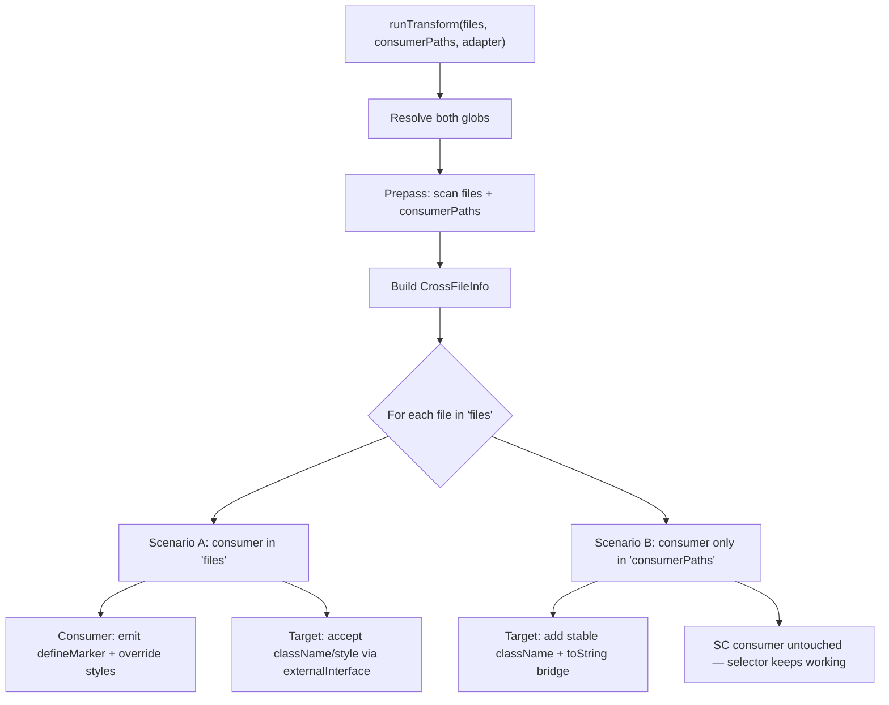

# Cross-File Component Selectors

**Prerequisite:** [`2026-02-09-marker-and-when-api-support-plan-opus.md`](2026-02-09-marker-and-when-api-support-plan-opus.md) must be fully implemented (Phases 0-3). This plan replaces the simple "TODO comment" approach from Phase 3 with proper multi-file prepass and wiring.

**Assumes available after prerequisite:**

- `relationOverride*` naming (Phase 1 rename)
- `makeAncestorKey` / `makeSiblingBeforeKey` / `makeAnySiblingKey` builders (Phases 1-2)
- `defineMarker()` emission and `resolveMarker()` abstraction (Phase 3 scaffolding)
- `stylex.when.ancestor(undefined, marker)` confirmed working (Phase 3 open question)

---

## Problem

When a styled-component uses `${ImportedComponent}` as a CSS selector, the codemod bails because `declByLocalName` only contains same-file declarations. Phase 3 handles this with a single-file `defineMarker()` + TODO comment. This plan goes further with a **prepass** that understands cross-file relationships and two distinct strategies:

**Scenario A — Both files being transformed (SC -> StyleX):** The consumer and target are both in the `files` glob. The prepass wires up `defineMarker()` across both files: the consumer emits override styles referencing a marker, and the target component is made to accept className/style so overrides can be passed via JSX.

**Scenario B — Incremental migration bridge (SC consumer stays, target converts):** The consumer file is NOT being transformed (still styled-components), but the target component IS being converted. The `${Target}` interpolation resolves to `.styledComponentId` at runtime. If the target is no longer a styled-component, this breaks. The bridge: add a stable className to the converted component and a `.toString()` shim so the SC interpolation keeps working during migration.

---

## Design Overview



---

## Scenario A: Both Files Transformed (Marker Approach)

The consumer file defines a marker locally and emits override styles. The child component receives those override styles via `stylex.props()` in JSX — same pattern as the existing same-file descendant overrides, but with `defineMarker()` instead of `defaultMarker()`.

### Consumer file output

```tsx
import * as stylex from "@stylexjs/stylex";
import { CollapseArrowIcon } from "./lib/collapse-arrow-icon";

const __styledCollapseButtonMarker = stylex.defineMarker();

export const App = () => (
  <div>
    <CollapseArrowIcon />
    <button {...stylex.props(styles.styledCollapseButton, __styledCollapseButtonMarker)}>
      <CollapseArrowIcon {...stylex.props(styles.collapseArrowIconInStyledCollapseButton)} />
      Toggle
    </button>
  </div>
);

const styles = stylex.create({
  styledCollapseButton: {
    /* ...base styles + gap... */
  },
  collapseArrowIconInStyledCollapseButton: {
    width: "18px",
    height: "auto",
    transition: "transform 0.2s",
    transform: {
      default: null,
      [stylex.when.ancestor(":hover", __styledCollapseButtonMarker)]: "rotate(180deg)",
    },
  },
});
```

### How it maps to the existing same-file pattern

```tsx
// Same-file (already working):
<button {...stylex.props(styles.button, stylex.defaultMarker())}>
  <span {...stylex.props(styles.icon, styles.iconInButton)} />
</button>

// Cross-file (this plan):
<button {...stylex.props(styles.button, __marker)}>
  <ImportedChild {...stylex.props(styles.importedChildOverrides)} />
</button>
```

Key differences:

- `defineMarker()` instead of `defaultMarker()` (prevents style bleeding across parents)
- Child is a component, not a native element — must accept and forward className/style
- Override styles on the child reference the specific marker: `stylex.when.ancestor(":hover", __marker)`
- Base descendant styles (no pseudo) are flat values, scoped by JSX placement (same as same-file)

### Target file requirements

The target component just needs `externalInterface: { styles: true }` so it accepts and forwards className/style. The prepass tells the target's transform to enable this. No marker is needed on the child itself.

---

## Scenario B: Bridge for Incremental Migration

### The problem

Styled-components resolves `${Component}` by calling `Component.toString()`, which returns `.${styledComponentId}`. The generated CSS uses this as a descendant selector. When the component is converted to StyleX, it loses its `styledComponentId` and the selector silently stops matching.

### The bridge

When converting a component that the prepass identifies as a selector target by unconverted SC files:

1. **Add a stable className** to the converted component's DOM output:

   ```tsx
   // After conversion (StyleX + bridge):
   function CollapseArrowIcon(props) {
     return <svg {...props} {...stylex.props(styles.icon)} className="sc2sx-CollapseArrowIcon" />;
   }
   // Make SC interpolation resolve to this class:
   CollapseArrowIcon.toString = () => ".sc2sx-CollapseArrowIcon";
   ```

2. **No changes needed to the SC consumer** — `${CollapseArrowIcon}` calls `.toString()` which returns `.sc2sx-CollapseArrowIcon`, and the DOM element has that class, so the descendant selector matches.

3. **Emit a TODO comment** in the converted file:
   ```tsx
   // TODO(sc2sx): Bridge className for SC consumers using ${CollapseArrowIcon} as selector.
   // Remove after converting: path/to/consumer-file.tsx
   ```

### Bridge className

- Format: `sc2sx-{ComponentName}` (e.g., `sc2sx-CollapseArrowIcon`)
- Deterministic, human-readable, easy to grep for cleanup
- Avoids collision with SC's hash-based class names
- Must be merged with StyleX's className output in the wrapper emitter

---

## Implementation

### 1. `consumerPaths` option in `RunTransformOptions`

In `src/run.ts`:

```typescript
export interface RunTransformOptions {
  files: string | string[];
  /** Additional files to scan for cross-file component selector usage. Files in this glob
   *  that are NOT in `files` trigger the bridge strategy (Scenario B). */
  consumerPaths?: string | string[];
  // ...existing...
}
```

### 2. Prepass module: `src/internal/prepass/cross-file-selectors.ts`

Scans all files from both globs. For each file:

1. Detect `import styled from "styled-components"` (or named imports)
2. Find tagged template literals (`styled.x`, `styled(Component)`)
3. Parse template expressions — identify `${Identifier}` where Identifier is an import from another file
4. Resolve import to absolute file path (relative resolution + `.ts`/`.tsx`/`.js`/`.jsx`/`index.*` probing)

```typescript
export interface CrossFileSelectorUsage {
  localName: string; // "CollapseArrowIcon"
  importSource: string; // "./lib/collapse-arrow-icon"
  importedName: string; // "CollapseArrowIcon" or "default"
  resolvedPath: string; // absolute path of target module
  consumerPath: string; // absolute path of consumer file
  consumerIsTransformed: boolean; // consumer in `files` glob?
}

export interface CrossFileInfo {
  /** Consumer file -> its cross-file selector usages */
  selectorUsages: Map<string, CrossFileSelectorUsage[]>;
  /** Target file -> exported components needing style acceptance (Scenario A) */
  componentsNeedingStyleAcceptance: Map<string, Set<string>>;
  /** Target file -> exported components needing bridge className (Scenario B) */
  componentsNeedingBridge: Map<string, Set<string>>;
}
```

### 3. Wire prepass into `runTransform`

In `src/run.ts`, after resolving the `files` glob:

- Resolve `consumerPaths` glob to file paths
- Run prepass over the union of both sets
- Classify each usage: `consumerIsTransformed = filesSet.has(consumerPath)`
- Pass `crossFileInfo` via jscodeshift options (works because `runInBand: true`)

### 4. Transport: `TransformOptions` / `TransformContext`

Add `crossFileInfo?: CrossFileInfo` to `TransformOptions`, store in `TransformContext`. Expose helpers:

- `getCrossFileSelectorsForFile(filePath)` — usages where this file is the consumer
- `getStyleAcceptanceForFile(filePath)` — components this file exports that need `{ styles: true }`
- `getBridgeRequirementsForFile(filePath)` — components this file exports that need a bridge className

### 5. `process-rules.ts` — handle cross-file selectors

At the `!childDecl` bail point (~line 235), before bailing check cross-file info:

- If this file is a consumer and the identifier matches a cross-file usage: proceed with marker-based override logic (reuse the existing `relationOverridePseudoBuckets` infrastructure from Phase 1-2)
- Track that the parent decl needs a `defineMarker()` emission
- Tag the override as cross-file so `descendant-overrides.ts` uses the marker in `stylex.when.ancestor()`

### 6. `descendant-overrides.ts` — marker argument in `makeAncestorKey`

The Phase 3 `resolveMarker()` abstraction should already support passing a marker to `makeAncestorKey`. Extend it to:

- Accept `undefined` pseudo for base descendant styles: `stylex.when.ancestor(undefined, marker)`
- Pass the marker identifier for cross-file overrides, omit it for same-file (keeps backward compat)

### 7. `rewrite-jsx.ts` — cross-file JSX handling

**Scenario A** (consumer being transformed):

- Emit `const __parentNameMarker = stylex.defineMarker()` at module scope
- Apply marker to parent element: `stylex.props(styles.parent, __parentNameMarker)`
- Apply override styles to imported child in JSX: `<ImportedChild {...stylex.props(styles.overrideKey)} />`

**Scenario B** (target needing bridge):

- In wrapper emitter: add bridge className to the root DOM element
- After component declaration: emit `ComponentName.toString = () => ".sc2sx-ComponentName"`
- Emit TODO comment listing which consumer files depend on the bridge

### 8. External interface override for Scenario A targets

In `analyze-before-emit.ts`:

- If the current file appears in `crossFileInfo.componentsNeedingStyleAcceptance`, set `decl.supportsExternalStyles = true` for matched components
- This overrides the adapter's `externalInterface` return value, ensuring the component accepts className/style

### 9. Bridge className in wrapper emitter for Scenario B targets

In `wrapper-emitter.ts`:

- If a component is in `crossFileInfo.componentsNeedingBridge`, add a static className to the JSX output
- Merge with StyleX className output (extend `emitStyleMerging()` to handle an extra static class)
- After the component function, emit the `.toString` shim as an expression statement

### 10. Multi-file test infrastructure

New test structure for multi-file cases:

- `test-cases/multi/selector-crossFileComponent/` (Scenario A)
  - `consumer.input.tsx` + `consumer.output.tsx`
  - `collapse-arrow-icon.input.tsx` + `collapse-arrow-icon.output.tsx`
- `test-cases/multi/selector-crossFileBridge/` (Scenario B)
  - `icon.input.tsx` + `icon.output.tsx` (target with bridge)
  - `consumer.sc.tsx` (unconverted SC file, scanned but not transformed)
- New `describe` block in `transform.test.ts`:
  1. Read all files in a multi-file test directory
  2. Run prepass over all input files
  3. Transform each file with the cross-file info
  4. Assert each output matches expected

### 11. Promote unsupported test cases

- Replace `_unsupported.selector-crossFileComponent` with the Scenario A multi-file test
- Replace `_unsupported.interpolation-componentAsIcon` (same-file non-styled component as selector) — this should already work after Phase 3 of the prerequisite plan

---

## Todos

- [ ] Prepass module: `src/internal/prepass/cross-file-selectors.ts`
- [ ] `consumerPaths` option in `RunTransformOptions` + prepass wiring in `runTransform`
- [ ] Transport `CrossFileInfo` through `TransformOptions` / `TransformContext` / `LowerRulesState`
- [ ] `process-rules.ts`: cross-file selector handling with marker-based overrides
- [ ] `descendant-overrides.ts`: marker argument + undefined pseudo in `makeAncestorKey`
- [ ] `rewrite-jsx.ts`: Scenario A — `defineMarker()` emission, marker on parent, overrides on child
- [ ] External interface override for Scenario A targets
- [ ] Scenario B bridge: stable className + `.toString()` shim in wrapper emitter
- [ ] Scenario B bridge: TODO comments listing dependent consumer files
- [ ] Multi-file test infrastructure
- [ ] Test case: Scenario A (both files transformed)
- [ ] Test case: Scenario B (bridge for incremental migration)
- [ ] Promote `_unsupported.selector-crossFileComponent` and `_unsupported.interpolation-componentAsIcon`

---

## Open Questions

1. **Bridge className merging**: The wrapper emitter needs to merge a static bridge className with StyleX's className. The existing `emitStyleMerging()` handles incoming className from props; we need to also handle an outgoing static className. May need a small extension.

2. **Import resolution depth**: V1 uses simple relative path resolution + extension probing. Support for `tsconfig.json` paths or barrel files (`index.ts` re-exports) is deferred.

3. **Multiple parents styling same child**: If two parents each define their own `defineMarker()` and style the same imported child, the child receives both override style keys in JSX. StyleX's last-wins semantics in `stylex.props()` should handle this, but worth verifying.

4. **Bridge `.toString()` type safety**: Adding `.toString` to a function component may need a type assertion or interface extension to satisfy TypeScript strict mode.
